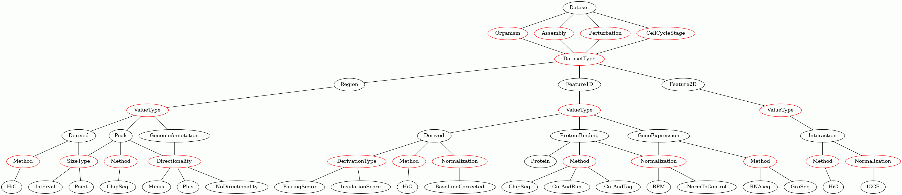

# HiCognition

[](https://github.com/psf/black "Black: The Uncompromising Code Formatter")
[](https://github.com/prettier/prettier-vscode "Prettier: An Opinionated Code Formatter")


[TODO:]:<> ( Add: docs badge, build badge, coverage badge. More on: https://github.com/dwyl/repo-badges)

Flask server for HiCognition with Vue.js frontend. HiCognition is a a data exploration tool that aims to allow stream-lined exploration of aggregate genomic data. HiCognition is centered around Hi-C data, but also enables integration of Chip-seq and region based data.

## Requirements

HiCognition runs on [docker](https://www.docker.com/) and therefore needs docker to be installed on your system.

## Development
Start of development server (this server includes hot-reload of the node.js development server and the flask development server):
```
docker-compose -f docker_dev.yml up
```

The app is then available on ```http://localhost:8080```.

If you get a network error:
```
docker-compose -f docker_dev.yml down
```

To create a user,
attach a shell to the ```flask-server``` container with
```
docker exec -it flask-server bash
```
Then

```
cd /code
```

Then type

```
flask shell
``` 

to start python in the app context, and then enter:

``` 
new_user = User(username="dummy")
new_user.set_password("1234")
db.session.add(new_user)
db.session.commit()
```

to add a new user. This can also be done via a command line tool:
```
Usage: flask user define [OPTIONS] NAME

Creates a new user either with defined password or password prompt. If
user with the name exists already, password is redefined.

Options:
-p, --password TEXT
--help Show this message and exit.
```
Example:

```
docker exec -it flask-server bash
source activate flask
flask user define dummy -p 1234
```

To add datasets you can use the add dataset command line tool:

```
Usage: flask dataset add [OPTIONS] JSON_PATH USER PASSWORD

  Adds datasets defined in a JSON to database and uploads it.

Options:
  --help  Show this message and exit.
```
an example can be found in ```test/testfiles/test.json``` which metadata you need for your dataset can be foung in the following figure:


and then you can preprocess them as follows:

```
Usage: flask dataset preprocess [OPTIONS] NAME USER PASSWORD

  Triggers preprocessing for all datasets with name with all available
  regions.

Options:
  --help  Show this message and exit.
```
Note that this preprocessing command line tool will preprocess a given feature dataset with all available region datasets. Additionally, to not have to deal with dataset ids, this tool uses a dataset name. If the name is not unique, it will fail and you have to do the preprocessing via the GUI.


## Running tests backend

```
docker exec -it flask-server bash
```
Then

```
cd /code
pytest .
```
The /code folder is linked to the outside of the container in your git folder.
Attention, if you test changes run first:
```
pip install .
```

## Running tests frontend
```
docker exec -it node bash
```
Then

```
cd /front_end
npm run test
```

## Changing Database

```
docker exec -it flask-server bash
```
Then

```
cd /code
flask db migrate -m "COMMIT-NAME"
flask db upgrade
```


## Installation

Clone this repo into a local folder:

```
git clone https://github.com/gerlichlab/HiCognition
```

and you are ready to got!

## Running the app

Open a powershell/bash session and change into the `HiCognition` directory.
In that directory, start the docker network with the following command:

```
docker-compose up -d
```

This will start HiCognition in the background. If this is the first time you are running the app, this will download docker-image dependencies and build the local containers. Once this command has finished, HiCognition is available at `http://localhost/`

If you need to access log-files, can do so via 
```
docker-compose -logs
```
execute the command above in the root directory of this repo.

## Project architecture and design decisions

For a detailed description of the project architecture and development design decisions see our [dev-git](https://github.com/gerlichlab/HiCognition/tree/master/documentation).

## Fullsize test data
A .mcool, .bw and .bed file can be found ar this [dropbox](https://www.dropbox.com/sh/zjfc6sgkbdp3ksh/AAAWrbgKt8hz4npNxSfh-RBja?dl=0) location.
